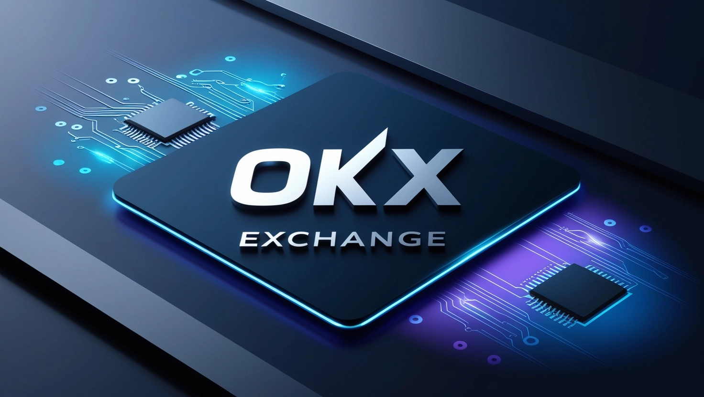
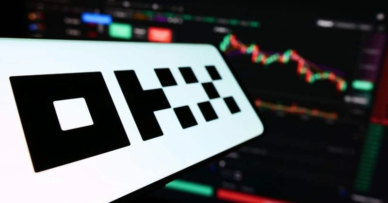
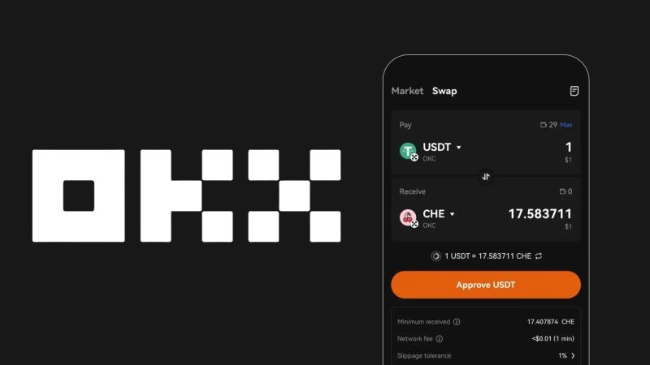
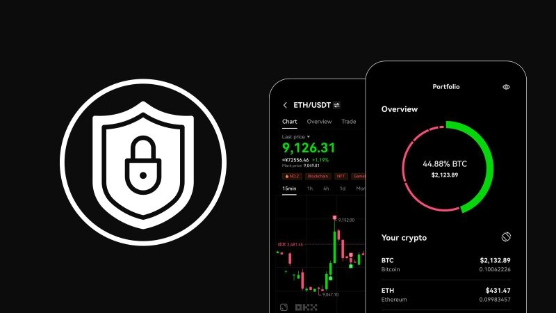
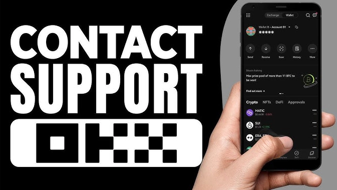
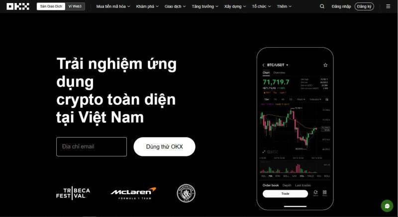
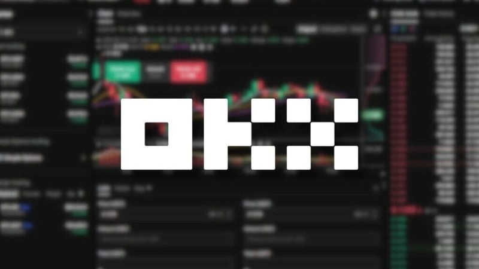

# OKX Review: Is This Crypto Exchange Really Reliable?

---

Choosing the right crypto exchange can make or break your trading experience. OKX promises advanced features, competitive fees, and rock-solid security—but does it actually deliver? Whether you're a cautious beginner or a seasoned trader hunting for better tools, understanding what OKX really offers matters. We'll walk through everything from their trading interface and fee structure to security measures and real user experiences, so you can decide if this platform fits your needs.

---

## OKX Origins: From Startup to Global Player

OKX launched in 2017, headquartered in Seychelles, with one clear goal: becoming a top-tier global crypto trading platform. Built on the foundation of OK Group—a company already known for blockchain projects—OKX inherited solid technical chops and industry know-how from day one.

Since then, they've grown into a familiar name across Asia, Europe, and beyond. The platform serves millions of users worldwide, offering everything from basic spot trading to complex derivatives. Their track record shows consistent expansion while maintaining platform stability, which matters when your money's on the line.

What sets OKX apart is their focus on building a comprehensive digital finance ecosystem. They're not just running an exchange—they're creating a space where users can trade, invest, earn passive income, and explore emerging sectors like DeFi and NFTs. The company keeps pushing technical improvements, tightening security, and refining user experience to stay competitive in this fast-moving market.

## What OKX Actually Offers: Core Trading Features

### Spot and Futures Trading

OKX covers both spot and futures markets, giving traders flexibility regardless of their strategy. Spot trading is straightforward—buy and sell crypto instantly at market prices. Perfect for beginners or anyone wanting to hold actual assets with high liquidity on major trading pairs.

Futures trading gets more interesting. OKX offers contracts with various expiration periods: weekly, monthly, quarterly. This lets traders speculate on future price movements without holding the underlying asset. For experienced traders who understand leverage and risk management, futures provide opportunities to profit from market volatility in both directions.

The platform supports both fixed-term contracts and perpetual contracts (futures with no expiration date), catering to different trading styles and timeframes.

### Margin Trading with Serious Leverage

👉 [Want to maximize your trading potential? See how OKX's margin features compare to the competition](https://www.okx.com/join/47044926)

OKX's margin trading lets users borrow funds to increase position sizes, potentially amplifying profits. Leverage goes up to 100x on major pairs like BTC/USDT and ETH/USDT. While high leverage can multiply gains, it equally magnifies losses—this isn't beginner territory.

The platform offers margin trading on numerous pairs beyond just Bitcoin and Ethereum. This variety lets experienced traders build diversified portfolios and execute sophisticated strategies. Just remember: leverage is a double-edged sword that requires solid risk management skills.

### Advanced Derivatives: Options and Perpetual Swaps

Beyond basic spot and futures, OKX provides specialized derivative products:

**Options Trading**: These give you the right (not obligation) to buy or sell assets at predetermined prices by specific dates. Options work well for hedging against volatility or speculating on price movements with defined risk. OKX supports both call and put options, offering strategic flexibility.

**Perpetual Swaps**: Similar to futures but without expiration dates. Hold positions as long as you want without worrying about contract rollovers. High liquidity on major pairs makes perpetual swaps suitable for long-term positions while maintaining flexibility to exit when needed.

### Passive Income Through Staking and Savings

Not everyone wants to actively trade 24/7. OKX offers staking and savings programs for earning passive returns on crypto holdings. Staking involves locking assets for set periods to earn interest—available for major coins like ETH, DOT, and other proof-of-stake networks.

Their flexible savings products let users earn interest without long-term commitments. Interest rates vary by asset and can be fixed or variable. These programs attract long-term investors who want their holdings to grow steadily without high-risk trading.

### DeFi Integration and NFT Marketplace

OKX isn't stuck in traditional centralized finance. They've expanded into decentralized finance (DeFi) and digital collectibles:

**DeFi Services**: Direct connections to DeFi protocols let users participate in lending, borrowing, and liquidity provision. This opens doors to the growing decentralized finance ecosystem, reducing dependence on traditional banking and increasing financial autonomy.

**NFT Marketplace**: As digital assets exploded in popularity, OKX launched their own NFT marketplace. Users can buy, sell, and trade everything from digital art to gaming items and exclusive collections. The platform gives creators a solid foundation for launching NFT projects while providing collectors access to unique digital assets.

## The Real Cost: Understanding OKX Fees

Fee structures can significantly impact profitability, especially for active traders. OKX maintains competitive rates across all trading types.

### Spot Trading Fees: Maker vs Taker

OKX uses the standard maker-taker model for spot trading:

- **Makers** place limit orders that add liquidity to the order book, earning lower fees as a reward
- **Takers** execute orders immediately against existing orders, removing liquidity and paying slightly higher fees

Fees scale based on your 30-day trading volume and account level. Higher tiers get better rates. Both maker and taker fees adjust as you climb the VIP ladder.

### Futures and Margin Costs

Derivatives follow a similar maker-taker structure but typically with lower base rates to encourage this trading activity. High-volume traders and VIP members can access near-zero maker fees or even rebates for providing liquidity.

Margin trading adds borrowing costs on top of trading fees. Interest rates vary by trading pair and account level but remain competitive compared to other major exchanges.

### Withdrawal Fees That Fluctuate

Withdrawal fees change based on blockchain network conditions. When networks get congested, fees increase to ensure faster transaction confirmations. Each cryptocurrency has different withdrawal costs depending on its underlying blockchain.

OKX regularly adjusts withdrawal fees to match network conditions. Check their website for current rates before withdrawing funds.

### Fee Reduction Programs

OKX runs several programs to help users minimize trading costs:

**OKB Token Benefits**: Holding OKB (OKX's native token) unlocks fee discounts across spot, futures, and margin trading. More OKB means bigger discounts. The token also grants access to exclusive token sales and staking opportunities.

**VIP Program**: Based on 30-day trading volume and account balance, the VIP program offers progressively lower fees. Top-tier VIPs can reach extremely low or even zero fees on certain trade types.

**Promotional Offers**: Regular campaigns provide fee discounts for new users and referral bonuses, creating additional opportunities to reduce trading costs.

## User Experience: Interface and Usability

### Web and Mobile Platforms

OKX's interface across both web and mobile strikes a balance between simplicity and functionality. The minimalist design avoids overwhelming users while providing professional-grade tools.

**User-Friendly Navigation**: Clean layouts make it easy to move between trading, wallet, portfolio, and financial services. Price charts and trading pairs are organized logically without cluttering the main interface—helpful for newcomers who might feel intimidated by complex trading platforms.

**Speed and Performance**: Platform responsiveness matters in volatile crypto markets. OKX delivers smooth performance on both web and mobile, processing orders quickly with minimal lag. Regular updates optimize performance and reduce interruptions.

**Mobile Functionality**: The mobile app includes full features—spot, futures, margin trading, staking, and even NFTs. Essential functions like order placement, portfolio tracking, and transaction history are accessible through simple taps, making on-the-go trading genuinely practical.

### Analysis Tools and Charts

OKX integrates TradingView, the industry-standard charting platform, providing professional-quality technical analysis tools. Charts display multiple timeframes from minute-by-minute to weekly views, helping traders spot trends effectively.

The platform supports dozens of technical indicators: MACD, RSI, EMA, Bollinger Bands, and more. Customize parameters, overlay multiple indicators, and apply them to your trading strategies. This depth makes OKX suitable for traders who rely heavily on technical analysis.

### Multi-Language Support

OKX supports over 20 languages including Vietnamese, making the platform accessible globally. Local language support eliminates barriers and helps users navigate confidently. Support extends to English, Chinese, Korean, Japanese, Spanish, and more—showing OKX's commitment to serving worldwide users.

### Real User Feedback

Users consistently praise OKX's stability and reliability, even during extreme market volatility. Security features like two-factor authentication (2FA), security alerts, and account protection tools provide peace of mind when managing digital assets.

Beginners appreciate the intuitive interface and logical organization that makes learning easier. However, some users mention occasional delays in account verification or technical glitches. OKX continues addressing these issues through regular platform improvements.

Customer support receives positive marks for responsiveness across live chat, email, and social media channels. Quick problem resolution enhances overall user satisfaction.

## Security: How Safe Is Your Money on OKX?

### Account Protection Layers

OKX implements multiple security layers to prevent unauthorized access:

**Two-Factor Authentication (2FA)**: Users can enable 2FA through Google Authenticator or SMS codes, adding an extra verification step for logins and transactions.

**Email/SMS Security Codes**: Sensitive actions like withdrawals, password changes, and account setting modifications require verification codes sent via email or SMS, blocking unauthorized transactions.

**API Security**: For algorithmic traders using APIs, OKX provides secure API keys with customizable access levels and permission controls, protecting API accounts from abuse.

### Asset Management and Cold Storage

OKX follows industry best practices for asset protection, storing approximately 95% of user funds in cold wallets—completely offline and isolated from internet-based attacks. This dramatically reduces exposure to hacking attempts.

Only a small portion sits in hot wallets to facilitate instant trading. OKX constantly monitors and controls hot wallet balances, maintaining both trading functionality and maximum security.

### Attack Prevention and User Insurance

OKX employs advanced security technologies including data encryption, multi-layer firewalls, and intrusion detection systems (IDS) to defend against external attacks. Regular security audits and prompt patch updates maintain system integrity.

For derivatives trading, OKX maintains an insurance fund covering losses from extreme market volatility and failed liquidations. This fund protects users and maintains market stability during unexpected events.

### Security Incident History

To date, OKX hasn't experienced major security breaches affecting user assets. The platform continues upgrading security measures to address potential threats and maintain the highest protection standards.

When minor technical issues or security concerns arise, OKX's technical team responds quickly to minimize impact on users and their assets. The company maintains transparent communication policies, updating users promptly if significant security matters develop.

## Customer Support: Getting Help When You Need It

### Support Channels

OKX provides multiple ways to reach their support team:

**Live Chat**: Available 24/7 on both web and mobile platforms, live chat offers quick access to support for account issues, trading questions, and technical problems.

**Email Support**: For complex issues requiring detailed explanations or security verification, email provides a suitable channel for thorough problem resolution.

**Social Media**: OKX maintains active presence on Twitter, Facebook, and Telegram. Beyond posting product updates and event announcements, support teams help users directly through these channels—useful for staying updated and engaging with the community.

### Response Times

OKX's support team delivers fast, professional responses. Live chat inquiries typically receive immediate replies or responses within minutes, ensuring urgent issues like transaction errors or account concerns get resolved quickly.

Support staff possess strong technical knowledge and can assist in multiple languages including Vietnamese, helping users communicate effectively and solve problems without language barriers.

### Help Center and Resources

Beyond direct support, OKX maintains a comprehensive **Help Center** with extensive documentation enabling users to solve common issues independently:

**Detailed Guides**: Step-by-step instructions cover everything from account registration and security setup to spot trading, futures, and margin trading. Clear, visual presentations help users navigate the platform confidently.

**FAQ Section**: Frequently asked questions with detailed answers cover security, deposits/withdrawals, account verification, and more. Users can quickly find needed information without waiting for support responses.

**Beginner Resources**: New users get access to introductory articles and video tutorials about crypto trading, technical analysis, and various investment options like staking and derivatives. These resources help newcomers understand the platform and develop safe, effective trading practices.

## Community Reputation and Trustworthiness

### User Community Feedback

OKX has built strong credibility in the global crypto market through service quality and operational stability. Community feedback provides accurate indicators of user satisfaction.

Users worldwide give positive feedback about platform stability, transaction speed, and security. On review sites like Trustpilot and app stores, OKX consistently receives high ratings. Users particularly appreciate the diverse trading features spanning spot, futures, and margin trading, plus robust account security measures.

On major forums like Reddit and Bitcointalk, and on reputable exchange review sites, OKX frequently ranks among top exchanges for features and user experience. Professional reviews from finance and crypto publications typically praise OKX's technical analysis tools, responsive customer support, and reasonable fee structure.

Some feedback mentions occasional slow account verification processes or technical glitches. OKX continues addressing these areas to improve user experience.

### Industry Standing

OKX ranks among the largest and most trusted exchanges, widely used by investors who value safety and transparency.

**Compared to Major Competitors**: With a diverse ecosystem and user-friendly interface, OKX stands alongside giants like Binance, Huobi, and Coinbase. The platform maintains regulatory compliance in multiple jurisdictions, strengthening international credibility. Regular technology updates and security system improvements help protect user assets.

👉 [Discover why millions choose OKX for secure crypto trading](https://www.okx.com/join/47044926)

**Legal Considerations**: OKX has faced some regulatory challenges in countries tightening crypto regulations. However, compared to some exchanges, OKX hasn't experienced major incidents causing user asset losses. The platform maintains insurance funds protecting user interests during unexpected risks—a trust-building factor earning high marks from the crypto community.

## Weighing the Pros and Cons

### OKX Strengths

**Competitive Fees with VIP Benefits**: OKX offers reasonable trading fees for spot and derivatives with clear maker-taker structures helping users optimize costs. VIP accounts and OKB token holders get additional discounts—particularly valuable for high-volume traders.

**Extensive Product Range**: From spot trading to futures, margin, perpetual swaps, and options, OKX serves diverse trading needs. Hundreds of trading pairs give users access to popular cryptocurrencies and niche tokens, attracting both retail and institutional investors.

**Strong Security**: Multi-layer account protection including 2FA, email/SMS verification, and cold storage for assets creates a secure environment. Regular security updates and risk insurance funds let users trade with greater confidence.

**Active Global Community**: As a major exchange, OKX has a vibrant worldwide community. Users regularly share experiences, strategies, and mutual support across forums and groups, creating a friendly trading environment helping newcomers learn and access useful information.

### OKX Weaknesses

**Complex Products for Beginners**: While product diversity is a strength, features like futures, margin, and options can overwhelm newcomers. New investors need solid knowledge to understand risks and manage complex trades effectively—potentially limiting full platform utilization initially.

**Geographic Restrictions**: OKX faces access limitations in some countries due to varying regulations. Not all users globally can register or access services. Some features, especially derivatives, may be restricted in specific regions.

**Variable Withdrawal Fees**: Withdrawal fees fluctuate based on blockchain network conditions, and some cryptocurrencies carry relatively high fees. This can create friction when transferring assets to personal wallets. While fees may decrease during stable markets, this remains a consideration for frequent withdrawals.

## Final Verdict

OKX stands as a leading cryptocurrency exchange offering advanced features from spot trading to sophisticated derivatives like futures, options, and margin trading. The platform provides competitive fees with special benefits for VIP users and OKB token holders. Strong multi-layer security, an active user community, and responsive multi-channel customer support build OKX's solid reputation.

The exchange serves both beginners and professional traders with diverse tools and services. However, some complex features may challenge newcomers using derivatives or margin trading—thorough research before starting is essential.

**For New Users**: OKX works well if you want a versatile exchange with a friendly interface and multi-language support. Start with spot trading to understand platform mechanics before exploring derivatives. Reviewing OKX's documentation and FAQ sections will help you master trading processes and build knowledge.

**For Experienced Traders**: OKX delivers advanced trading features with professional technical analysis tools and risk management capabilities suited to experienced investors. VIP programs and OKB fee discounts benefit frequent or high-volume traders significantly. Consider withdrawal fees and potential legal restrictions affecting certain regions.

Overall, OKX is a reliable, comprehensive exchange suitable for newcomers and professionals alike. Users should carefully evaluate complex features and withdrawal costs to optimize their experience and protect assets when using OKX for crypto trading.
